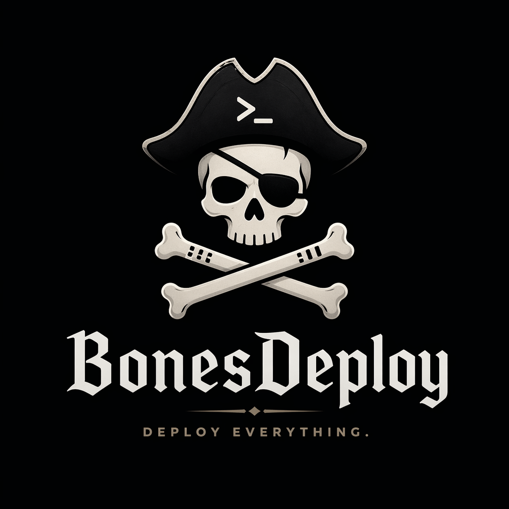

# BonesDeploy ☠️

## Git Deployments with a Spine in a Barebones Framework 🏴‍☠️

<div style="margin:0 auto; display: block;"></div>

> WARNING: BonesDeploy is still under active development. There may be some cool bugs!

A drop-in Rust deployment system for git-based deployments over SSH. BonesDeploy scaffolds hook scripts and deployment configs into your repo, syncs them to a remote bare repository, and manages permissions through provisioning-time contracts (setgid directories + systemd sandboxing) without forcing containers, a control plane, or a platform layer.

It produces two binaries:
- **`bonesdeploy`** — local CLI for setup and management
- **`bonesremote`** — server-side tool for remote operations, installed on the deployment host

## Why BonesDeploy

BonesDeploy is built for developers who want `git push` deployments without handing deployment over to a PaaS or rebuilding everything around Docker.

- **Drop-in** — add it to an existing repo, scaffold `.bones/`, and deploy over your existing SSH + bare repo workflow
- **Git-native** — hooks, remotes, and bare repos stay the source of truth instead of hiding deployment behind a daemon
- **Permission-aware** — BonesDeploy treats deploy-user to service-user handoff as a first-class concern instead of leaving shared groups or ACL sprawl behind
- **Self-hosted and lightweight** — ideal for VPSes, old servers, and Raspberry Pis where simplicity matters more than orchestration
- **Editable by design** — the generated hooks and deployment scripts are yours; BonesDeploy gives you structure, not lock-in

If you want a Heroku-style abstraction layer, use a platform. If you want a disciplined, transparent deployment skeleton that drops into a normal Linux box, use BonesDeploy.

## How It Works

BonesDeploy uses a two-user permission contract:

1. A **deploy user** (default: `git`) handles SSH access, owns the bare repo, and creates release artifacts. This user has restricted sudo ability (service restart only) but no password login.
2. A **runtime user** (defaults to the project name) owns runtime state — shared files, sockets, and writable directories. This user has no home folder, no login, and no sudo ability — limiting attack scope.

Permissions are a **provisioning-time contract**, not a deployment-time repair:

- The deploy user owns immutable release archives (`releases/`) with setgid so the runtime group can read them.
- The runtime user owns mutable shared state (`shared/`).
- Root creates users, directories, systemd units, and sockets during provisioning.
- No deploy step changes ownership or applies recursive chown.

The sudoers configuration is strictly limited to `bonesremote service restart`, the only command that needs elevated privileges during normal operation.

This gives you a clean privilege boundary:

- the **deploy user** can connect, stage, and activate
- the **runtime user** runs the app
- `root` provisions the machine and restarts services

## Installation

### Local (bonesdeploy)

```sh
cargo install --git https://github.com/AlextheYounga/bonesdeploy.git bonesdeploy
```

### Server (bonesremote)

```sh
sudo cargo install --root /usr/local --git https://github.com/AlextheYounga/bonesdeploy.git bonesremote --force
```

Then run the remote setup:

```sh
sudo bonesremote init
```

This installs a sudoers drop-in at `/etc/sudoers.d/bonesdeploy` so the deploy user can run only the privileged `bonesremote` commands without a password.

## Usage

### Initial Setup

In your project repository:

```sh
bonesdeploy init
```

This will:
1. Create a `.bones/` folder with hooks and deployment script templates
2. Prompt for project name, branch, remote name, host, and port
3. Add `.bones` to `.gitignore`
4. Symlink the `pre-push` hook into `.git/hooks/`
5. Create a local deployment git remote if needed

BonesDeploy assumes opinionated server defaults unless you change them in `.bones/bones.toml`:

- `port = "22"`
- `web_root = "public"`
- `project_root = "/srv/sites/<project_name>"`
- `deploy_user = "git"`
- `runtime_user = "<project_name>"`
- `runtime_group = "<project_name>"`
- `release_group = "<project_name>-release"`

The `init` command creates the local `.bones/` scaffold and records project settings.
If `pyinfra` is missing, BonesDeploy installs it automatically into an isolated managed environment under `XDG_STATE_HOME` (defaults to `~/.local/state/bonesdeploy/pyinfra/.venv`).
Template-based projects then use `bonesdeploy remote runtime` to prompt for a framework and scaffold runtime assets (for example: Laravel installs PHP + PHP-FPM, Django installs Python runtime packages, Node templates install Node.js).
`bonesdeploy remote setup` handles machine bootstrap as root, while `bonesdeploy remote runtime` applies per-site runtime assets such as AppArmor and nginx after a quick confirmation prompt.

To customize nginx behavior, edit the Jinja2 templates in the `src/assets/` directory of the `bonesinfra` repo and re-run `bonesdeploy remote runtime`.

When DNS is ready, enable SSL with certbot (separate from runtime):

```sh
bonesdeploy remote ssl --domain app.example.com --email ops@example.com
```

This runs the dedicated SSL deploy to obtain a Let's Encrypt certificate and configure the runtime nginx router for HTTPS. SSL is fully decoupled from runtime configuration.

### Syncing Configuration

After editing hooks or deployment scripts in `.bones/`:

```sh
bonesdeploy push
```

This rsyncs `.bones/` to the remote bare repo and symlinks the hooks.

### Deploying

Just push to your deployment remote:

```sh
git push production master
```

The hook chain handles the rest:
1. **pre-push** (local) — runs `bonesdeploy doctor --local`
2. **pre-receive** (remote) — inert (`exit 0`); all deployment logic runs in post-receive
3. **post-receive** (remote) — resolves the configured deployment ref, then runs a single `bonesremote deploy --config <bones_toml> --revision <newrev>` command that orchestrates the full pipeline:
    - Doctor check → stage release → git checkout into `build/workspace` → wire shared paths → run deployment scripts → activate release (atomic symlink) → restart nginx → prune old releases

`pre-push -> pre-receive -> post-receive`

If you set `deploy_on_push = false`, pushes only update refs. Run manual deploy when ready:

```sh
bonesdeploy deploy
```

To roll back to the previous release without rebuilding:

```sh
bonesdeploy rollback
```

### Health Checks

```sh
bonesdeploy doctor          # check local + remote
bonesdeploy doctor --local  # check local only
```

### Updating

Update BonesDeploy binaries to the latest release:

```sh
bonesdeploy update
```

This atomically updates both local (`bonesdeploy`) and remote (`bonesremote`) using symlink flipping for zero-downtime updates with instant rollback capability.

## Configuration

`bonesdeploy init` generates `.bones/bones.toml`:

```toml
remote_name = "production"
project_name = "myproject"
repo_path = "/home/git/myproject.git"
project_root = "/srv/sites/myproject"
port = '22'
branch = 'master'
domain = ''
preview_domain = ""
email = ''
deploy_on_push = false
ssl_enabled = false
releases = 5
```

`host` and `repo_path` are inferred from the deployment remote URL when possible; if parsing fails, init asks only for those missing values.

## Project Structure

```
.bones/
├── bones.toml           # project configuration
├── runtime.toml         # framework runtime configuration
├── hooks.sh             # shared hook functions imported by hook entrypoints
├── deployment/
│   └── 01_*.sh          # deployment scripts (run sequentially)
└── hooks/
    ├── pre-push         # symlinked to .git/hooks/pre-push
    ├── pre-receive
    └── post-receive
```

Hooks are written to `.bones/hooks/` once during init and import shared functions from `.bones/hooks.sh`. After that they belong to you — edit freely. Deployment scripts in `.bones/deployment/` must be numbered (e.g. `01_install_deps.sh`, `02_build.sh`) and are always run in order.

## Good Fit

BonesDeploy is a strong fit when you want:

- direct Linux deploys over SSH
- simple app hosting on one machine at a time
- explicit provisioning-time permission contracts with setgid group inheritance
- a lightweight alternative to container-first deployment stacks
- something you can run comfortably on low-cost hosts and Raspberry Pis

BonesDeploy can still deploy Docker-based apps if your deployment scripts call `docker compose`, but Docker is optional rather than the foundation.

## License

MIT

## Coverage

Coverage is driven with `cargo-llvm-cov` using cargo aliases in `.cargo/config.toml`.

Install once:

```sh
cargo install cargo-llvm-cov
```

Generate a terminal summary:

```sh
cargo cov
```

Generate lcov output for CI tooling:

```sh
cargo cov-lcov
```

Generate an HTML report:

```sh
cargo cov-html
```

Reports are written under `target/coverage/`.
