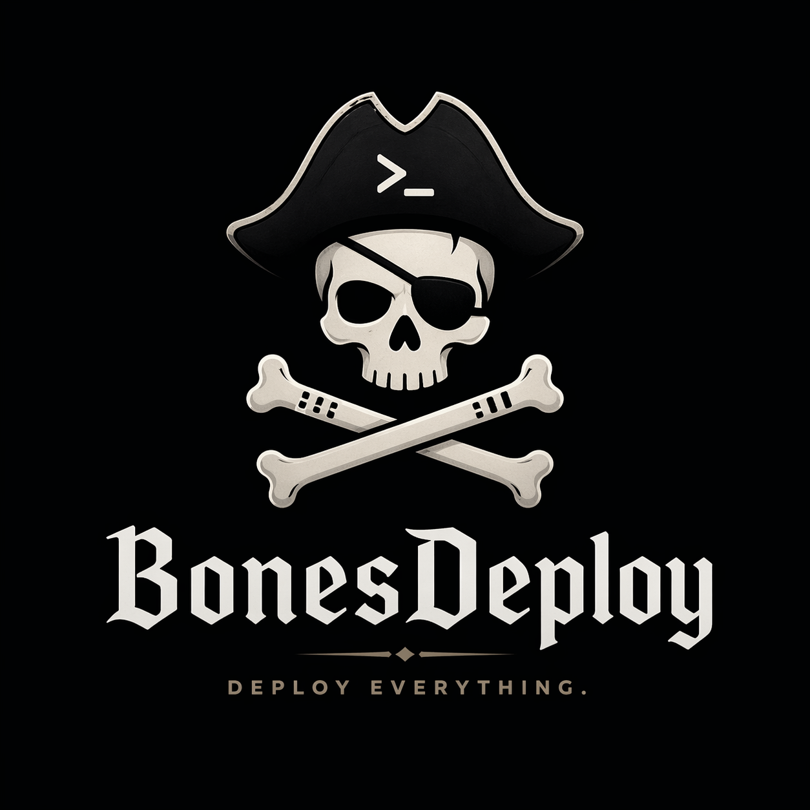

# BonesDeploy ☠️

## Deploy a dozen modern, isolated web apps on a $5 Linux box, without ever touching the server. Docker not required.

<div style="margin:0 auto; display: block;">
  
</div>

BonesDeploy is a feature-rich, yet very lightweight deployment framework for developers and vibe-coders who want to run self-hosted sites, with an emphasis on tried and true, old-school security principles. Most modern deployment systems just wrap everything in Docker. Docker is incredible, one of the best technologies ever. But I, and many others, are getting tired of running complex machinery through YAML.

> WARNING: BonesDeploy is still under active development, but is almost in a stable state. Expect sharp edges and perhaps some cool bugs.

## Why BonesDeploy Exists

Self-hosting should not require building your own miniature cloud platform.

Coolify is impressive software, and it serves developers who want a flexible, Docker-first platform capable of running almost anything. BonesDeploy makes a different bet: most web applications do not need that much machinery.

BonesDeploy is batteries included. It supports a deliberate set of modern web frameworks, makes the important decisions for you, and runs directly on the operating system wherever possible. There is less to configure, less to understand, and less sitting between your application and the machine you paid for.

Docker is remarkable technology. It is also frequently overkill for deploying a small web application. You inherit a daemon, container networking, volumes, port mappings, Compose files, and another security model layered on top of Linux. Get one port binding wrong and a private database can become a public one. BonesDeploy avoids that entire class of mistake by refusing unsafe configurations and keeping private services private by default.

Containers still have their place. BonesDeploy uses rootless Podman for isolated builds, where the boundary is genuinely useful. The build runs inside a constrained environment, produces a release, and then disappears.

The application itself runs as an ordinary Linux service. Every site gets its own user, processes, permissions, and resource limits. Systemd, AppArmor, seccomp, cgroups, and the Unix permission model do the work they were designed to do.

The result is not a general-purpose platform for every imaginable workload. It is a complete deployment system for the kind of web applications most developers actually run: automatic server setup, HTTPS, encrypted secrets, isolated builds, atomic releases, rollbacks, diagnostics, and strong defaults.

All without turning a $5 Linux box into a tiny Kubernetes tribute act.

BonesDeploy deploys project releases to a remote Linux server over SSH. It scaffolds ordinary project-local deployment and infrastructure files, resolves one immutable Git revision for each deployment, and runs the release lifecycle remotely without turning a configuration repository into the control plane.

No platform.
No control plane.
No required Docker setup.
No pretending your VPS is a tiny Kubernetes cluster.

It gives you versioned releases, rollback, shared runtime state, service restarts, and per-site Linux isolation using the tools already on the box.

**It's also AI agent friendly, with dedicated commands to help your agent understand how to setup and manage your server without ever leaving your machine.**

BonesDeploy builds two binaries:

- **`bonesdeploy`** — the local CLI
- **`bonesremote`** — the remote release runner

And embeds a Python provisioning runtime:

- **`bonesinfra`** — `crates/bonesinfra/python/`, embedded by the Rust `bonesinfra` crate

Each initialized project receives the complete BonesInfra distribution in
`infra/.framework/`. Commands execute that committed managed framework through a
project-scoped dependency environment; `infra/custom/` remains
project-owned and is preserved by updates. The managed framework can be updated
explicitly, while modified managed files are reported as conflicts instead of
being silently overwritten.

## The Point

Deploying small apps should not require a platform team.

Most apps need a few boring things done correctly:

- put each release in its own directory
- keep uploads and runtime files outside the release
- restart the right service
- keep a few old releases around
- roll back without drama
- stop one site from casually reading another site's files

That is what BonesDeploy is for.

## Site Isolation

This is the part I care about.

BonesDeploy treats each site as its own thing on the server. Each site gets its own isolated services via systemd.

Each site can get its own:

- Linux user
- Linux group
- writable shared paths
- systemd runtime services
- nginx config
- AppArmor policy
- Seccomp configs

The deploy user deploys.
The runtime user runs the app.
Root provisions the machine.

That is the whole model.

## Why Not Just Docker?

Docker is useful. It gives you packaging, repeatability, and another layer of isolation.

But Docker is heavy, and slow, and you see this when you try running multiple Docker sites on a machine with less than 8GB of RAM.

Docker is also where a lot of people hide from Linux.

Instead of setting up users, groups, permissions, services, sockets, nginx, PHP-FPM, AppArmor, and runtime directories correctly, we stuff the app in a container and call it done.

Sometimes that is the right trade.

BonesDeploy takes the other trade.

It assumes the server is the deployment target, and then does the annoying work of centralizing the Linux setup per site.

You can still use Docker with BonesDeploy. Put `docker compose` in your deploy scripts.

Docker just is not the foundation.

## Runtime Backends

BonesDeploy can run applications directly on Linux or inside Docker. Native is
the default. Select the backend during initialization or set
`RUNTIME_BACKEND=docker` in the project `.env`:

```dotenv
RUNTIME_BACKEND=docker
```

Docker mode keeps the existing release lifecycle and rootless Podman build
pipeline. Docker is used only for the application runtime: BonesDeploy owns
the container command and mounts, the active release is read-only, shared
paths remain writable, and host Nginx and TLS remain the public ingress.

Docker runtime mode uses the conventional privileged Docker daemon. It does
not grant Docker access to the deploy, build, runtime, or git users, does not
execute project Compose files, and does not mount the Docker socket into an
application. This is a different security tradeoff from native mode because a
privileged daemon is part of the runtime control plane.

Laravel Docker runtime selection is currently the supported containerized
runtime. Other frameworks continue to use the native backend.

## Runtime Templates

Runtime templates set up the Linux pieces for a framework.

| Template | Status     | Notes                              |
| -------- | ---------- | ---------------------------------- |
| Laravel  | Working    | PHP / PHP-FPM setup                |
| Next.js  | Working    | Node runtime setup                 |
| Nuxt     | Working    | Nuxt runtime setup                 |
| Vue      | Working    | Static frontend setup              |
| SvelteKit| Working    | Node runtime setup                 |
| Django   | Not tested | Python / Gunicorn not tested yet   |
| Rails    | Not tested | Ruby not tested yet                |

Templates are not magic. They are shared server setup so every project does not become a custom snowflake.

Native Laravel sites also receive a per-site systemd queue worker by default.
It runs `php artisan queue:work` with bounded lifetime and explicit writable
Laravel storage paths, and is restarted with the application after activation.

## Install

Install the local CLI:

```sh
cargo install --locked --git https://github.com/AlextheYounga/bonesdeploy.git bonesdeploy
```

Install the remote runner on the server:

```sh
sudo cargo install --locked --root /usr/local --git https://github.com/AlextheYounga/bonesdeploy.git bonesremote --force
```

Remote host provisioning, including sudoers policy, is handled by `bonesinfra` during `bonesdeploy init` remote setup.

## Start a Project

From your project repo:

```sh
bonesdeploy init
```

For CI or AI agents, pick a runtime template and pass variables non-interactively:

```sh
bonesdeploy init --non-interactive --project-name atlas --host deploy.example.com \
  --template laravel --runtime-backend docker --framework-var php_version=8.5 \
  --service postgres --service valkey
```

See `bonesdeploy skill doc templates` for every template and its variables.

This creates:

```text
.
├── .env                    # local project and provisioning inputs; do not commit
├── .env.build              # committed, non-secret build inputs
├── deployment/             # committed build and prepare scripts
└── infra/                  # committed project infrastructure
    ├── .framework/         # BonesDeploy-managed BonesInfra snapshot
    ├── custom/             # project-owned provisioning extensions
    └── secrets/             # encrypted project secrets
```

The files are yours.
Edit them.
Commit them.
Read them when something breaks.

The managed framework is executed when you invoke `bonesdeploy remote runtime`.
The project-owned `infra/custom/` package is composed after the managed
framework. Edit custom provisioning and local templates as project
infrastructure; use `bonesdeploy update` to refresh the managed snapshot.

Deployment scripts run in filename order:

```text
01_install_deps.sh
02_build.sh
03_migrate.sh
```

## Set Up the Server

Provision the base server:

```sh
bonesdeploy remote setup
```

Provision the site runtime:

```sh
bonesdeploy remote runtime
```

This runs the provisioning in your project's `infra/.framework/` package:
framework services, per-site nginx, AppArmor, and your `infra/custom/` project
extensions. Templates rendered by the managed framework come from
`infra/.framework/src/bonesinfra/frameworks/<name>/templates/`.

Database services selected at init are provisioned by `bonesdeploy setup`, or later with:

```sh
bonesdeploy remote services
```

Supported services are PostgreSQL, MariaDB, MySQL, MongoDB, Valkey, and Redis. They listen only on localhost; Redis and Valkey use separate per-project instances, while the SQL/Mongo services use database-scoped accounts. Use an SSH tunnel for workstation access. Generated credentials live in the protected remote `shared/.env`, never in Git. MariaDB and MySQL are alternatives and cannot share one host.

Add SSL after DNS points at the server:

```sh
bonesdeploy remote ssl --domain app.example.com --email ops@example.com
```

SSL is separate on purpose. Get the site working first. Add certificates after DNS is real.

## Deploy

Deploy:

```sh
bonesdeploy deploy
```

Rollback:

```sh
bonesdeploy rollback
```

Inspect releases, including a release that is currently building:

```sh
bonesdeploy releases
```

Cancel a named building or interrupted release and clean its temporary build state:

```sh
bonesdeploy releases kill 20260715_225306
```

Check the setup:

```sh
bonesdeploy doctor
```

Check only the local side:

```sh
bonesdeploy doctor --local
```

`doctor` reports three states: green checks are healthy, yellow pending items
are expected next steps (such as the first Git push after setup), and red
failures need attention. Pending first-push state exits successfully so setup
can finish without looking broken. For agents and scripts, use the stable
machine-readable next-step guide:

```sh
bonesdeploy skill next --format json
```

Inspect every project-specific remote artifact and managed systemd service
declared by the managed framework manifest, the configured services, and the SSL
strategy without changing the server:

```sh
bonesdeploy manifest
bonesdeploy manifest --format json
```

The manifest reports present, missing, and wrong-kind paths, plus active and
enabled state for project-managed services. JSON is intended for automation;
neither format prints file contents or secrets.

Embedded documentation for AI agents lives under the `skill` command:

```sh
bonesdeploy skill                    # orientation doc
bonesdeploy skill list               # names of every embedded doc
bonesdeploy skill doc workflows      # end-to-end flows
bonesdeploy skill doc methodology    # permission model and doctrine
```

Update the local and remote binaries:

```sh
bonesdeploy update
```

## Config

`bonesdeploy init` creates a project-root `.env` with local provisioning inputs:

```dotenv
PROJECT_NAME=myproject
REMOTE_NAME=production
HOST=deploy.example.com
SSH_USER=root
PORT=22
BRANCH=main
TEMPLATE=custom
RUNTIME_BACKEND=native
```

`.env` is local configuration and is excluded from Git. `.env.build` is the
committed, non-secret build configuration. Runtime secrets are edited through
`bonesdeploy secrets edit`, stored encrypted at `infra/secrets/.env.gpg`, and
sent to the protected remote `shared/.env` with `bonesdeploy secrets push`.

## Project Structure

```text
deployment/
├── build/
│   └── 01_*.sh      # build scripts (run sequentially in the build container)
└── prepare/
    └── 01_*.sh      # prepare scripts (run as the site user before activation)
```

Deployments are explicit: `bonesdeploy deploy` does not push application
changes, synchronize a second repository, or trigger from Git hooks.

Build scripts in `deployment/build/` must be numbered (for example `01_install_deps.sh`, `02_build.sh`) and run in order inside bonesremote's `buildpack-deps:bookworm` container. Each build script is capped at 300 seconds by default; a configured timeout of `0` disables that per-script limit. Bonesremote streams an ephemeral copy of the deployment bundle into the container at `/workspace/deployment`, so the build user never needs host access to control-plane files. BonesInfra provisions a private persistent cache for each build user; bonesremote mounts it at `/workspace/cache` and exposes `BUILD_CACHE_DIR`. The shared deployment functions use it for Node, Corepack, npm, pnpm, Yarn, Composer, and Bundler downloads. Installed dependency trees and build output remain disposable. Prepare scripts in `deployment/prepare/` also run in order, but on the host as the site runtime user after shared paths are wired and before activation. Bonesremote streams the shared functions into each prepare shell before the prepare script.

Build scripts can set runtime options such as `NODE_OPTIONS=--max-old-space-size=<MiB>` when a project needs a V8 heap limit. Node does not provide a general CPU-percentage limit; `UV_THREADPOOL_SIZE` only changes libuv's file-system, crypto, DNS, and zlib worker pool. Beyond per-script timeouts, BonesInfra caps each build user's host-level slice at 80% CPU quota, 80% memory high/max, and `MemorySwapMax=0`, so a runaway build fails rather than exhausting host memory or swap.

BonesRemote also exposes safe scalar runtime values as transient `BONES_*` variables in the build container (for example, `BONES_RUNTIME_IS_STATIC` and `BONES_RUNTIME_TEMPLATE`). Runtime permissions, shared paths, service identities, server connection details, and DNS/SSL configuration are excluded. Use `.env.build` for committed public build configuration; use remote `shared/.env` for runtime secrets.

Rootless Podman commands run through the dedicated build user's systemd user manager. Deploy verifies that manager, Podman, and the Infra-provisioned build cache before staging a release. The runtime application user remains a separate home-less, non-login account and never owns or operates the build container.

Each deployment resolves its requested branch or revision to one full Git SHA,
then uses that immutable revision for source, deployment scripts, infrastructure,
and build-safe scalar inputs throughout the release lifecycle. Runtime plaintext
secrets and decryption keys are never included in build inputs.

## Good Fit

BonesDeploy is for:

- one-server apps
- VPS deployments
- small production apps
- side projects that grew up
- Raspberry Pis and old servers
- developers who want to understand their deploys
- developers who want Linux isolation without making Docker mandatory

## Bad Fit

BonesDeploy is not trying to be:

- Kubernetes
- Heroku
- Nomad
- a PaaS
- a dashboard
- a managed database service
- a multi-node orchestration layer

Use those when you need those.

## Coverage

Install:

```sh
cargo install cargo-llvm-cov
```

Run:

```sh
cargo cov
```

LCOV:

```sh
cargo cov-lcov
```

HTML:

```sh
cargo cov-html
```

Reports go here:

```text
target/coverage/
```

## License

MIT
