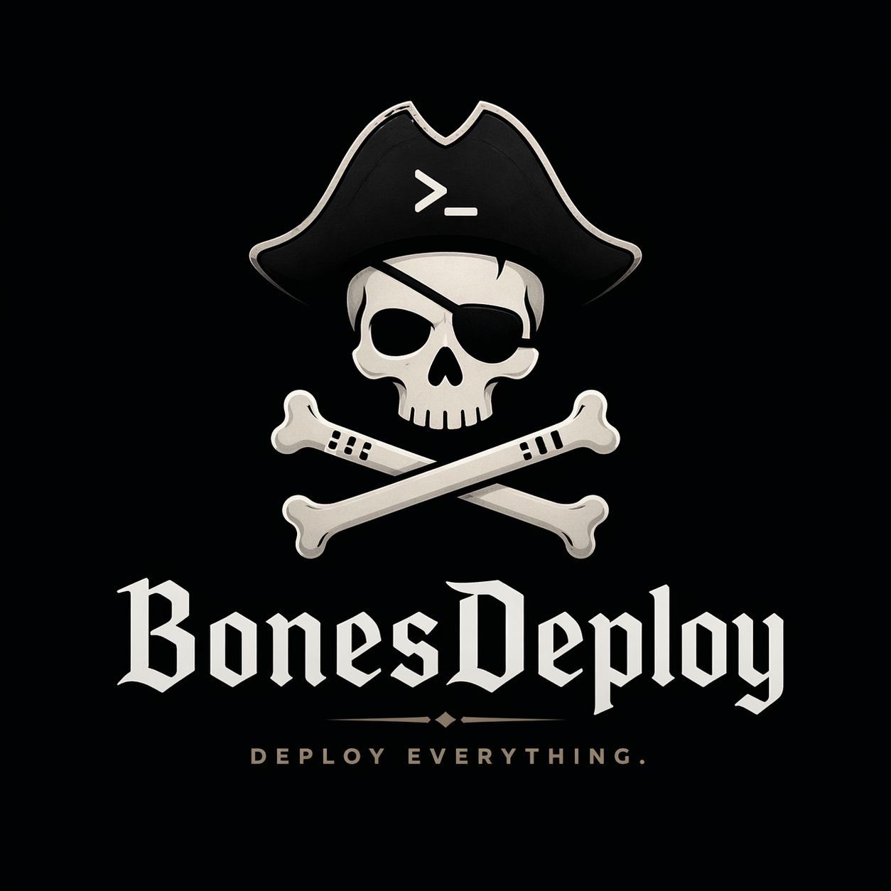

# BonesDeploy ☠️

## Deploy a dozen modern, isolated web apps on a $5 Linux box, without ever touching the server. Docker not required.

<div style="margin:0 auto; display: block;">
  
</div>

BonesDeploy is a feature-rich, yet very lightweight deployment framework for developers and vibe-coders who want to run self-hosted sites, with an emphasis on tried and true, old-school security principles. Most modern deployment systems just wrap everything in Docker. Docker is incredible, one of the best technologies ever. But I, and many others, are getting tired of running complex machinery through YAML.

> WARNING: BonesDeploy is still under active development, but is almost in a stable state. Expect sharp edges and perhaps some cool bugs.

## Why BonesDeploy Exists

Self-hosting should not require building your own miniature cloud platform.

Coolify is impressive software, and it serves developers who want a flexible, Docker-first platform capable of running almost anything. BonesDeploy makes a different bet: most web applications do not need that much machinery.

BonesDeploy is batteries included. It supports a deliberate set of modern web frameworks, makes the important decisions for you, and runs directly on the operating system wherever possible. There is less to configure, less to understand, and less sitting between your application and the machine you paid for.

Docker is remarkable technology. It is also frequently overkill for deploying a small web application. Native BonesDeploy sites avoid its daemon, container networking, volumes, port mappings, and additional security model. Compose deployments deliberately accept those tradeoffs when a project needs a container-defined stack.

Containers still have their place. Native builds run locally in a constrained Docker container, produce a complete release artifact, and then disappear. Production servers receive and activate artifacts; they never build native application source.

The application itself runs as an ordinary Linux service. Every site gets its own user, processes, permissions, and resource limits. Systemd, AppArmor, seccomp, cgroups, and the Unix permission model do the work they were designed to do.

The result is not a general-purpose platform for every imaginable workload. It is a complete deployment system for the kind of web applications most developers actually run: automatic server setup, HTTPS, encrypted secrets, isolated builds, atomic releases, rollbacks, diagnostics, and strong defaults.

All without turning a $5 Linux box into a tiny Kubernetes tribute act.

BonesDeploy deploys project releases to a remote Linux server over SSH. It scaffolds ordinary project-local deployment and infrastructure files, resolves one immutable Git revision for each deployment, and runs the release lifecycle remotely without turning a configuration repository into the control plane.

No platform.
No control plane.
No required Docker setup.
No pretending your VPS is a tiny Kubernetes cluster.

It gives you versioned releases, rollback, shared runtime state, service restarts, and per-site Linux isolation using the tools already on the box.

**It's also AI agent friendly, with dedicated commands to help your agent understand how to setup and manage your server without ever leaving your machine.**

BonesDeploy builds two binaries:

- **`bonesdeploy`** — the local CLI
- **`bonesremote`** — the remote release runner

And embeds a Python provisioning runtime:

- **`bonesinfra`** — `crates/bonesinfra/python/`, embedded by the Rust `bonesinfra` crate

Each initialized project receives a committed versioned `infra/bonesinfra-<version>-py3-none-any.whl` and the
managed templates under `infra/templates/`. Commands execute the wheel through a
project-scoped dependency environment; `infra/custom/` remains project-owned
and is preserved by updates. Managed templates are refreshed wholesale by
`bonesdeploy update`.

## The Point

Deploying small apps should not require a platform team.

Most apps need a few boring things done correctly:

- put each release in its own directory
- keep uploads and runtime files outside the release
- restart the right service
- keep a few old releases around
- roll back without drama
- stop one site from casually reading another site's files

That is what BonesDeploy is for.

## Site Isolation

This is the part I care about.

Native BonesDeploy sites receive isolated services via systemd. Compose sites instead use a stable, site-scoped Compose project and the security settings declared by the project.

Each site can get its own:

- Linux user
- Linux group
- writable shared paths
- systemd runtime services
- nginx config
- AppArmor policy
- Seccomp configs

The deploy user deploys.
The runtime user runs the app.
Root provisions the machine.

That is the whole model.

## Why Not Just Docker?

Docker is useful. It gives you packaging, repeatability, and another layer of isolation.

But Docker is heavy, and slow, and you see this when you try running multiple Docker sites on a machine with less than 8GB of RAM.

Docker is also where a lot of people hide from Linux.

Instead of setting up users, groups, permissions, services, sockets, nginx, PHP-FPM, AppArmor, and runtime directories correctly, we stuff the app in a container and call it done.

Sometimes that is the right trade.

BonesDeploy takes the other trade.

It assumes the server is the deployment target, and then does the annoying work of centralizing the Linux setup per site.

You can use Docker Compose as an explicit runtime backend. Docker remains optional and is not the native deployment foundation.

## Runtime Backends

BonesDeploy can run applications directly on Linux or inside Docker. Native is
the default. Select the backend during initialization or set
`RUNTIME_BACKEND=docker` in the project `.env`:

```dotenv
RUNTIME_BACKEND=docker
```

Docker mode executes one conventional project-owned Compose file from each
immutable release. Compose owns Dockerfiles, images, services, health checks,
networks, and named volumes. BonesDeploy validates, pulls, and builds the
candidate stack locally for `linux/amd64`, tags every service image with an
immutable release-specific identity, and includes those images plus a generated
override in the artifact. Production loads the artifact and reconciles the
stable `bonesdeploy-<site>` project with `docker compose up --no-build --pull
never --wait`. Numbered BonesDeploy build and prepare scripts are native-only.

Set `BONES_COMPOSE_PORT` when host nginx should proxy to a loopback-published
Compose port. Without it, the stack owns ingress and may publish ports directly.
`BONES_COMPOSE_WAIT_TIMEOUT` controls readiness waiting and defaults to 120
seconds.

Compose mode uses the conventional rootful Docker daemon and is a
**reduced-guarantee mode**. The project Compose file is trusted privileged
input and may select images, users, mounts, capabilities, namespaces, networks,
and public ports outside the native security model. BonesDeploy does not add a
Docker socket mount. Named volumes survive deployments, rollback, and release
pruning; rollback restores the previous Compose definition but does not reverse
volume data or external side effects.

## Runtime Templates

Runtime templates set up the Linux pieces for a framework.

| Template | Status     | Notes                              |
| -------- | ---------- | ---------------------------------- |
| Laravel  | Working    | PHP / PHP-FPM setup                |
| Next.js  | Working    | Node runtime setup                 |
| Nuxt     | Working    | Nuxt runtime setup                 |
| Vue      | Working    | Static frontend setup              |
| SvelteKit| Working    | Node runtime setup                 |
| Django   | Not tested | Python / Gunicorn not tested yet   |
| Rails    | E2E coverage | Pinned Ruby / Puma setup         |

Templates are not magic. They are shared server setup so every project does not become a custom snowflake.

Native Laravel sites also receive a per-site systemd queue worker by default.
It runs `php artisan queue:work` with bounded lifetime and explicit writable
Laravel storage paths, and is restarted with the application after activation.

## Install

Install the local CLI:

```sh
cargo install --locked --git https://github.com/AlextheYounga/bonesdeploy.git bonesdeploy
```

Install the remote runner on the server:

```sh
sudo cargo install --locked --root /usr/local --git https://github.com/AlextheYounga/bonesdeploy.git bonesremote --force
```

When building from a checkout, the Rust build verifies that the committed
`crates/bonesinfra/assets/bonesinfra-<version>-py3-none-any.whl` matches the Python source. If Python
source has changed, regenerate the wheel with `cargo build-wheel` before
running `cargo build` or `cargo install --path`. The version script runs this
command automatically after updating the Python version.

Remote host provisioning, including sudoers policy, is handled by `bonesinfra` during `bonesdeploy server setup`.

## Start a Project

From your project repo:

```sh
bonesdeploy init
```

Native deployments always build the configured committed revision locally with
Docker for `linux/amd64`, then upload the complete artifact. Compose deployments
perform their config, pull, and image-build steps locally and upload the release
tree and exact service images. There is no server-side application build or
pull fallback. Docker is a local build dependency for native builds and a
production runtime dependency only for Compose sites. BonesDeploy automatically
pulls its pinned native builder image when it is not already installed.

For CI or AI agents, pick a runtime template and pass variables non-interactively:

```sh
bonesdeploy init --non-interactive --project-name atlas --host deploy.example.com \
  --template laravel --runtime-backend docker --framework-var php_version=8.5 \
  --service postgres --service valkey
```

See `bonesdeploy skill doc templates` for every template and its variables.

This creates:

```text
.
├── .env                    # local project and provisioning inputs; do not commit
├── .env.build              # committed, non-secret build inputs
├── deployment/             # committed build and prepare scripts
└── infra/                  # committed project infrastructure
    ├── bonesinfra-*.whl     # committed BonesInfra runtime
    ├── templates/           # committed managed templates
    ├── custom/             # project-owned provisioning extensions
    └── secrets/             # encrypted project secrets
```

The files are yours.
Edit them.
Commit them.
Read them when something breaks.

The managed wheel is executed when you invoke `bonesdeploy site runtime`. The
project-owned `infra/custom/` package is composed after the managed framework.
Edit custom provisioning and templates as project infrastructure; use
`bonesdeploy update` to refresh managed templates.

Deployment scripts run in filename order:

```text
01_install_deps.sh
02_build.sh
03_migrate.sh
```

## Set Up the Server

Provision the reusable server baseline once per host:

```sh
bonesdeploy server setup --yes
```

The baseline includes etckeeper: `/etc` is tracked in a root-owned Git
repository with package defaults, and every successful provisioning run ends
with an etckeeper commit recording its `/etc` changes.

Then provision each project once, including its base, runtime, and doctor:

```sh
bonesdeploy site setup --yes
```

`site setup` runs exactly server readiness, site base provisioning, runtime,
and site doctor. It does not push Git or secrets, configure SSL, or
deploy a release.

For additional projects on an already prepared host, do not repeat server setup.
Initialize the project and run only its project-scoped setup:

```sh
bonesdeploy init
bonesdeploy site setup --yes
```

Do not run server setup concurrently from multiple projects. It mutates shared
host resources such as package indexes and security configuration.

This runs the provisioning from your project's versioned `infra/bonesinfra-*.whl`:
framework services, per-site nginx, AppArmor, and your `infra/custom/` project
extensions. Templates rendered by the managed framework come from
`infra/templates/`.

Site setup and runtime provisioning do not install or start Cloudflare. To
explicitly expose a site through an accountless Quick Tunnel, run:

```sh
bonesdeploy site tunnel start
bonesdeploy site tunnel status
```

The tunnel uses a loopback-only nginx HTTP origin, which proxies to the site's
existing nginx Unix socket. Application processes are not exposed directly, and
Cloudflared is not part of the normal site target. The service is enabled after
explicit startup and restarts on failure or host reboot until removed with:

```sh
bonesdeploy site tunnel stop
```

The `trycloudflare.com` URL can change whenever Cloudflared restarts. Quick
Tunnels are for development and review, have no uptime SLA, limit concurrent
requests, and do not support Server-Sent Events. A deterministic per-site
loopback port is used; startup fails safely during nginx validation if that port
collides with another local listener.

After editing the complete remote environment, explicitly publish it before the
first deploy or whenever it changes:

```sh
bonesdeploy secrets push
```

Native sites connect to independently managed databases and caches. Compose
sites declare databases, caches, workers, networks, and volumes directly in the
project Compose file.

Add SSL after DNS points at the server:

```sh
bonesdeploy site ssl --domain app.example.com --email ops@example.com
```

SSL is separate on purpose. Get the site working first. Add certificates after
DNS is real. A real domain uses the existing public Nginx and Certbot path. If a
Quick Tunnel is running, remove it explicitly with `bonesdeploy site tunnel
stop` after the real domain is ready.

## Deploy

Deploy:

```sh
bonesdeploy deploy
```

Rollback:

```sh
bonesdeploy rollback
```

Inspect releases, including a release that is currently building:

```sh
bonesdeploy site releases
```

Cancel a named building or interrupted release and clean its temporary build state:

```sh
bonesdeploy site releases kill 20260715_225306
```

Check the setup:

```sh
bonesdeploy doctor
```

Check only the local site side:

```sh
bonesdeploy site doctor --local
```

`doctor` reports green healthy checks, yellow pending operational work, and red
failures that need attention. Site setup and deployment do not require a first
Git push. For agents and scripts, use the stable machine-readable next-step
guide:

```sh
bonesdeploy skill next --format json
```

Inspect every project-specific remote artifact and managed systemd service
declared by the managed framework manifest, the configured services, and the SSL
strategy without changing the server:

```sh
bonesdeploy site manifest
bonesdeploy site manifest --format json
```

The text manifest presents paths as a tree with colored status markers. JSON
retains complete present, missing, and wrong-kind details plus active and
enabled state for project-managed services. JSON is intended for automation;
neither format prints file contents or secrets.

Remove the remote resources declared by that manifest:

```sh
bonesdeploy site delete
bonesdeploy site delete --yes
```

Deletion is irreversible. Without `--yes`, you must type the configured project
name exactly. It preserves local source, Git configuration, secrets, and
BonesInfra caches, while persisting remote decommissioning state so an
interrupted deletion remains blocked from deployment and can be rerun safely.

Embedded documentation for AI agents lives under the `skill` command:

```sh
bonesdeploy skill                    # orientation doc
bonesdeploy skill list               # names of every embedded doc
bonesdeploy skill doc workflows      # end-to-end flows
bonesdeploy skill doc methodology    # permission model and doctrine
```

Update the local and remote binaries:

```sh
bonesdeploy update
```

## Export Shared Data

Download the configured site's complete remote `shared/` directory as a ZIP:

```sh
bonesdeploy site export
bonesdeploy site export --output ./exports
bonesdeploy site export --output ./atlas-shared.zip
```

Without `--output`, or when it names an existing directory, the archive is
written as `<site>-shared-<YYYYMMDD_HHMMSS>.zip` using UTC. An otherwise
nonexistent path is treated as the archive filename. Existing files are never
overwritten, and the local archive is created with mode `0600`.

The archive has a top-level `shared/` directory and includes hidden files such
as `shared/.env`. Treat it as sensitive. This is a live, best-effort export: it
does not stop the application, so files changed during transfer are not a
point-in-time snapshot. It uses the configured root SSH connection directly and
is separate from scheduled Borg backups.

## Scheduled Backups

Projects initialized by BonesDeploy get one encrypted Borg repository per site
at `/var/lib/bonesdeploy/backups/<site>.borg`. A root-only cron entry runs
nightly by default (configurable with `BONES_BACKUP_SCHEDULE`, a five-field
crontab expression) and archives the site's `shared/` directory, then prunes
archives older than the retention window (`BONES_BACKUP_RETENTION_DAYS`, 30
days by default).

- The Borg passphrase is generated during `bonesdeploy init` and stored in the
  gitignored `.env` as `BONES_BORG_PASSPHRASE`; it is provisioned to the server
  as a root-only file (`0600`) and never appears in logs or command lines.
- Archives are named `<site>_<YYYYMMDD_HHMMSS>` (UTC) and contain only
  `shared/`. Releases are reproducible from Git; application runtime secrets
  live in `shared/.env`, which is included.
- Output and failures are visible in journald:
  `journalctl -t bonesdeploy-backup`.
- There is no manual backup command. Restores use ordinary Borg tooling as root,
  for example `borg list /var/lib/bonesdeploy/backups/<site>.borg` followed by
  `borg extract`.
- Backups live on the deployment server. Copying the repository off-site is
  your responsibility; automated replication is not included.

Projects initialized before this feature have no passphrase configured and
keep their previous behavior.

## Config

`bonesdeploy init` creates a project-root `.env` holding the application's
local environment plus one BonesDeploy-managed configuration block:

```dotenv
# Local environment for the application.

# >>> BonesDeploy managed configuration >>>
BONES_PROJECT_NAME=myproject
BONES_REMOTE_NAME=production
BONES_HOST=deploy.example.com
BONES_SSH_USER=root
BONES_PORT=22
BONES_BRANCH=main
BONES_TEMPLATE=custom
BONES_RUNTIME_BACKEND=native
# <<< BonesDeploy managed configuration <<<
```

`.env` is the local environment and is excluded from Git. Its application-owned
content (everything outside the managed block, including comments and values)
is never replaced by `init`; only the delimited `BONES_*` block is rewritten.
`BONES_*` keys never leave the workstation — they are stripped from production
environments. `.env.build` is the committed, non-secret build configuration.
Runtime secrets are edited through `bonesdeploy secrets edit`, stored encrypted
at `infra/secrets/.env.gpg`, and explicitly sent as the complete protected
remote `shared/.env` with `bonesdeploy secrets push`. The push atomically
replaces the remote file; it does not read, merge, or upload the local root
`.env`. `bonesdeploy deploy` does not push environment values. The local managed
block supplies the values used to derive BonesRemote's narrow deployment
descriptor at deploy time. Only release retention and the selected backend's
remotely consumed settings are mirrored to `/srv/conf/<site>/bones.json` for
remote-only commands; the encrypted file contains only values the application
needs at runtime.

## Project Structure

```text
deployment/
├── build/
│   └── 01_*.sh      # build scripts (run sequentially in local Docker)
└── prepare/
    └── 01_*.sh      # prepare scripts (run as the site user before activation)
```

Deployments are explicit: `bonesdeploy deploy` does not push application
changes, synchronize a second repository, or trigger from Git hooks.

Routine deployment SSH connects as the `deploy` deploy identity, not root. That
session may invoke only direct configuration-sync and deployment BonesRemote
commands through non-interactive sudo. Anchored sudoers argument rules deny
other BonesRemote subcommands and extra or trailing arguments; they require
sudo 1.9.10 or newer. The lifecycle retains the existing root-owned state,
lock, and release boundaries; prepare scripts run as the site runtime user.
Hosts provisioned with the former `git` or `bonesdeploy` deploy identity must be
reprovisioned; BonesDeploy does not migrate those accounts or fall back to them.

Build scripts in `deployment/build/` must be numbered (for example `01_install_deps.sh`, `02_build.sh`) and run in order. `bonesdeploy` resolves the configured branch to its exact committed Git revision, exports that tree, and runs the native build contract in a local Docker container using the pinned `linux/amd64` builder image. Each local Docker build operation is capped at 300 seconds by default; a configured timeout of `0` disables that per-operation limit. The local cache, installed dependency trees, and build output are disposable. BonesDeploy packages the complete post-build tree as a `tar.gz` artifact and streams it over SSH. Prepare scripts in `deployment/prepare/` still run in order on the host as the site runtime user after shared paths are wired and before activation. BonesRemote streams the shared functions into each prepare shell before the prepare script.

Build scripts can set runtime options such as `NODE_OPTIONS=--max-old-space-size=<MiB>` when a project needs a V8 heap limit. Node does not provide a general CPU-percentage limit; `UV_THREADPOOL_SIZE` only changes libuv's file-system, crypto, DNS, and zlib worker pool.

BonesDeploy exposes fixed public contract metadata and safe derived `BONES_*` values to the build container (for example, `BONES_RUNTIME_IS_STATIC` and `BONES_RUNTIME_TEMPLATE`). The build does not inherit ambient host variables or receive the root `.env`, decrypted production environment, backup credentials, SSH agent, credential stores, host home, or Docker socket. Runtime permissions, shared paths, service identities, server connection details, and DNS/SSL configuration are excluded. Use committed public `.env.build` for build configuration; use remote `shared/.env` for runtime secrets.

The runtime application user remains a separate home-less, non-login account. Production provisioning creates no native build user, build cache, image store, or local-container state.

Each deployment resolves its configured local branch to one full Git SHA, then
uses that immutable revision for source, deployment scripts, infrastructure,
and build-safe scalar inputs throughout the release lifecycle. The server
receives the resulting artifact without resolving a source branch, maintaining
an application repository, or requiring a first push. It verifies the artifact's
compressed length and SHA-256, then safely extracts only bounded relative files,
directories, and relative symlinks. Runtime plaintext secrets and decryption
keys are never included in build inputs; the local artifact excludes the root
`.env`.

After verified extraction, BonesRemote uses the same promotion, shared-path
wiring, prepare, sealing, activation, service restart, pruning, and rollback
behavior for every native deployment. Django dependencies are installed and the
dependency files are packaged under `.python-packages` during the local build,
and release-owned `.venv/bin` wrappers invoke the provisioned production
interpreter. Django prepare is limited to production-state work such as
validation, migrations, and static-file collection.

Artifact receipt enforces a 64 KiB manifest, a 2 GiB compressed payload, at most
100,000 archive entries, 4 KiB paths and symlink targets, and a 4 GiB expanded
file-size budget. Compose inventories allow at most 128 services/images.

Previous-installation migration, registry-backed image transfer, private build
or registry credentials, artifact signing, SBOMs, and resumable upload are
deliberately deferred. The current contract transfers complete artifacts over
SSH and does not claim cryptographic build provenance beyond the verified
manifest and payload digest.

Production hosts are supported only on Debian 12 or newer and Ubuntu 24.04 or
newer, on `x86_64`. Older releases and other distributions fail clearly. This is
a breaking contract: BonesDeploy provides no fallback or migration guarantee for
previous server-side native build installations.

## Good Fit

BonesDeploy is for:

- one-server apps
- VPS deployments
- small production apps
- side projects that grew up
- Raspberry Pis and old servers
- developers who want to understand their deploys
- developers who want Linux isolation without making Docker mandatory

## Bad Fit

BonesDeploy is not trying to be:

- Kubernetes
- Heroku
- Nomad
- a PaaS
- a dashboard
- a managed database service
- a multi-node orchestration layer

Use those when you need those.

## Coverage

Install:

```sh
cargo install cargo-llvm-cov
```

Run:

```sh
cargo cov
```

LCOV:

```sh
cargo cov-lcov
```

HTML:

```sh
cargo cov-html
```

Reports go here:

```text
target/coverage/
```

## License

MIT
